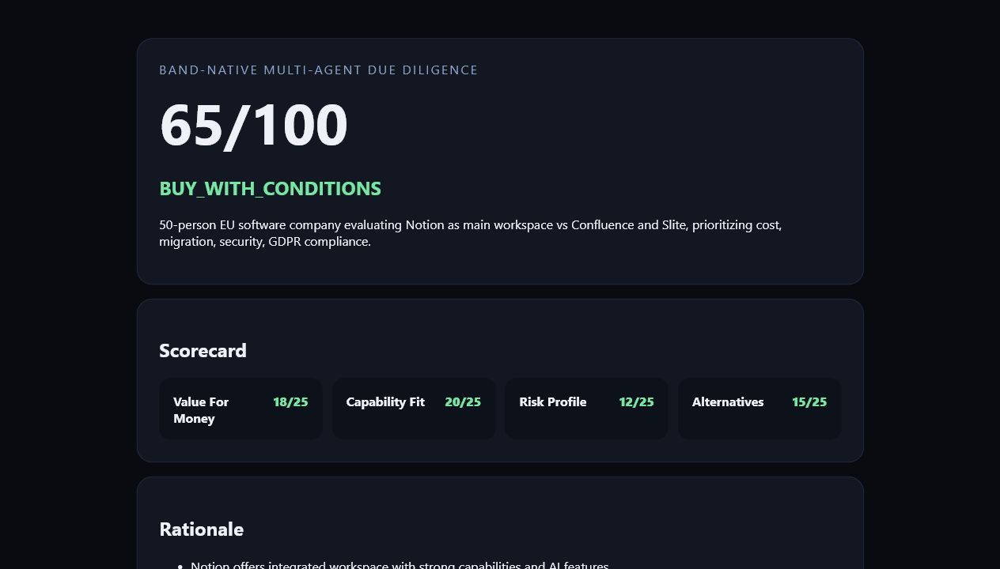

# Verdict Room

Verdict Room is a Band-native multi-agent courtroom for product and vendor
due diligence. A user submits a purchase case in a Band room; specialized
agents gather evidence, compare alternatives, debate risks, recruit a
compliance specialist when needed, and publish a scored verdict.

The live prototype has completed a full six-agent Band-room run, including
dynamic Compliance recruitment, timeout recovery, and a persisted scorecard.
After hardening delivery, two consecutive verification runs completed end to
end in about three minutes each with no reminders, no missing agents, and no
runtime errors.



## Why Band

Band is the coordination layer, not a notification wrapper. Every handoff,
shared fact, debate round, participant change, and verdict happens in the
room. Agents only receive messages that mention them, so the protocol uses
explicit `@Researcher`, `@Scout`, `@Critic`, `@Advocate`, `@Compliance`, and
`@Arbiter` handoffs.

## Agents

| Agent | Job | Default provider |
| --- | --- | --- |
| Arbiter | Deterministic debate state machine and verdict | AI/ML API |
| Researcher | Sourced pricing, features, and complaints | AI/ML API |
| Scout | Alternatives and trade-offs | AI/ML API |
| Critic | Risks, hidden costs, privacy trigger | Featherless |
| Advocate | Evidence-based defense and closing | Featherless |
| Compliance | Dynamically recruited specialist | Featherless |

AI/ML API handles the tool-heavy roles. Featherless Premium handles the
debate roles through a deterministic adapter that posts model output to Band,
so those models do not need native function calling. Optional Groq, Gemini,
and OpenRouter keys extend the fallback chain.

## Quickstart

Requirements: Python 3.11+, `uv`, Band Pro, AI/ML API and Featherless keys,
and six remote agents created in Band.

```powershell
Copy-Item .env.example .env
Copy-Item agent_config.yaml.example agent_config.yaml
uv sync
uv run python scripts/smoke_llm.py
uv run python scripts/smoke_band.py
uv run python -m src.run_all
```

In Band, create a room, add Arbiter, Researcher, Scout, Critic, and Advocate,
then send:

```text
@Arbiter Analyze whether a 50-person company should buy Notion as its main
workspace. Compare Confluence and Slite. Prioritize total cost, migration,
security, and GDPR.
```

Compliance should not be in the initial room. The Arbiter adds it when the
Critic emits `COMPLIANCE CONCERN`.

## Configuration

- `.env`: Band URLs, provider keys, model IDs, timeout settings.
- `agent_config.yaml`: Band UUID and one-time API key for each remote agent.
- Both secret files are gitignored. Never commit them.

The installed Band SDK 1.0 uses `from band import Agent`, Python 3.11+, and
`await agent.run()`. Some older documentation still shows the pre-1.0
`thenvoi` import.

## Development

```powershell
uv run ruff format .
uv run ruff check .
uv run pytest -q
uv run python -m src.tools.web_research "Notion pricing"
```

Verdicts are stored under `data/verdicts/`. Generate the static demo report:

```powershell
uv run python scripts/make_report.py data/verdicts/<room-id>.json
```

## License

MIT
